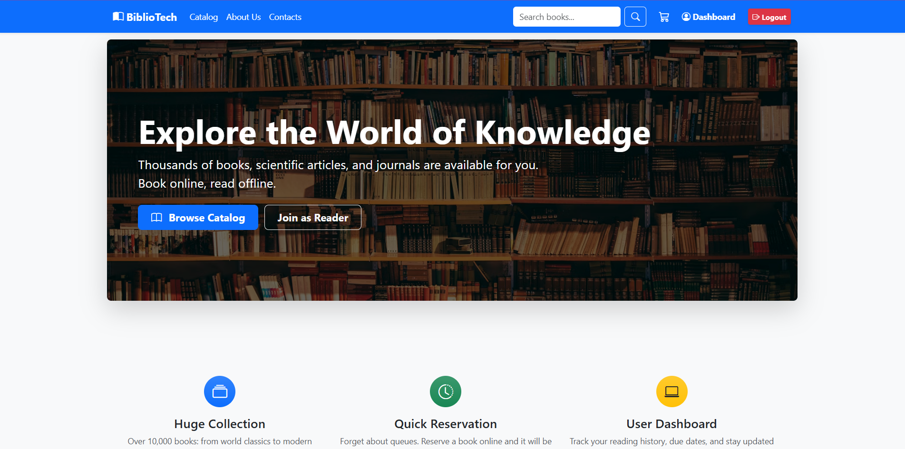
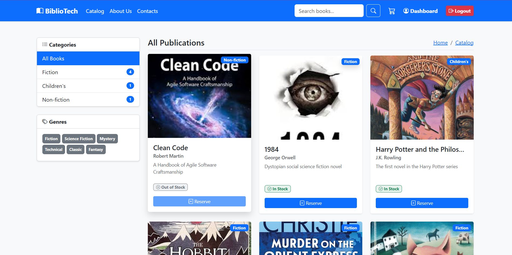
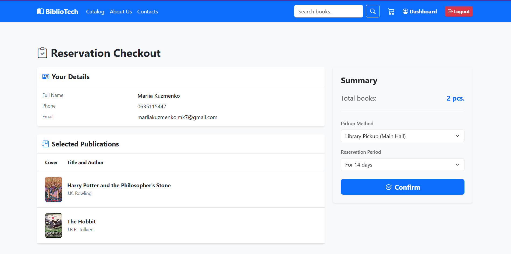

# BiblioTech - Library Management System


## About the Project

**BiblioTech** is a comprehensive web application designed to automate and streamline library management processes. It provides a user-friendly interface for browsing literature, managing physical inventory, and handling book reservations.

Unlike a standard e-commerce platform, this system implements specific library domain logic: it clearly separates the concept of a "Publication" (the literary work) from a "Publication Instance" (the physical copy on the shelf), and manages loan periods rather than direct sales.

## Key Features

* **Role-Based Authorization:** Secure user registration and login implemented with Spring Security and BCrypt password encoding. Distinct access levels for Guests, Readers (`ROLE_READER`), and Administrators.
* **Catalog & Search:** Intuitive browsing of available literature with secure, GET-based keyword search functionality.
* **Inventory Management:** The system automatically tracks the availability of physical book copies. Reservations are blocked if all instances of a specific publication are currently loaned out or reserved.
* **Session-Based Cart:** Users can temporarily store books in an HTTP session-based reservation cart before finalizing their order.
* **Order Processing:** Seamless checkout process allowing users to select their preferred retrieval method (Library Pick-up or Reading Room) and loan duration (14 or 30 days), with automatic due date calculation.
* **User Dashboard:** A dedicated space where the user's Library Card is linked to their account, allowing them to track active reservations and history.

## Tech Stack

* **Backend:** Java, Spring Boot (Web, Data JPA, Security)
* **Frontend:** HTML5, CSS3, Bootstrap 5, FreeMarker (.ftl) templating engine
* **Database:** MySQL + Hibernate ORM
* **Architecture:** MVC (Model-View-Controller), Service Layer, Repository Pattern

## Screenshots

**1. Home / Landing Page**
*(A welcoming user interface designed with Bootstrap 5, showcasing the project's frontend structure.)*


**2. Library Catalog & Search**
*(A dynamic data grid displaying available literature fetched from the database, featuring GET-based search.)*


**3. Dynamic Checkout & Reservation**
*(Session-based cart handling user details, physical instance availability, and loan parameters.)*


## Local Setup & Installation

1. Clone the repository:
   ```bash
   git clone [https://github.com/mariiakuzmenko/Bibliotech-Library-System.git](https://github.com/mariiakuzmenko/Bibliotech-Library-System.git)